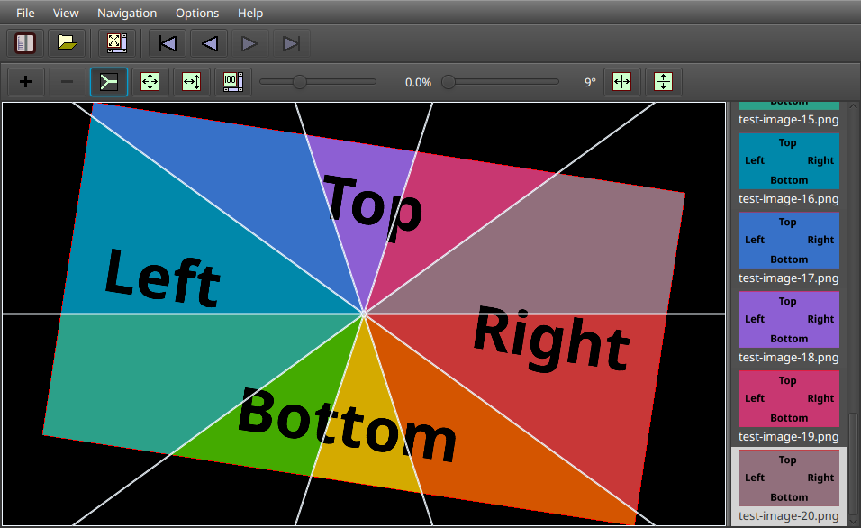
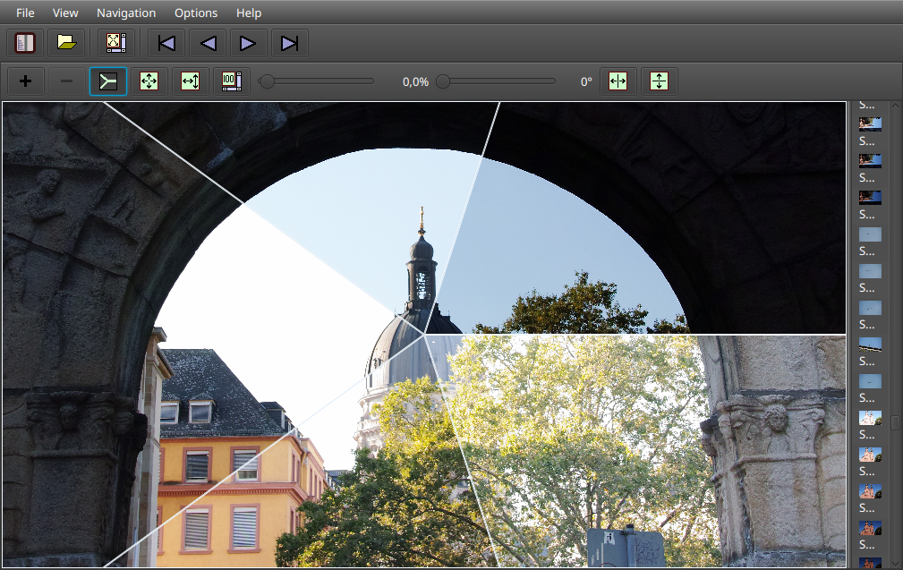

# [Diascope](https://github.com/berndmichaely/diascope)

Diascope is an image viewer application for desktop. *Unique features* include:

  * a multi layer image mode to overlay two or more images for comparison – split dividers can be freely moved and rotated
  * a multi layer image mode to overlay a second image over a base image in a spot – the spot is freely movable and resizable.

Diascope is written based on Java/JavaFX and so should run on any platform providing Java and JavaFX support. (It is currently being developed and tested on Linux.)

### Screenshots

## Building the application

Have a recent JDK installed, get the sources and run from the root directory:

    ./gradlew run

to run the application immediately or

    ./gradlew installDist

to build the application into the `./build/install/Diascope` directory. The minimum Java version required is 23 (it is tested with Eclipse Adoptium JDK on Linux). When running on Java24, you might want to add some JVM options to suppress warnings, e.g. by using an environment variable:

    export JAVA_OPTS='--enable-native-access=javafx.graphics --sun-misc-unsafe-memory-access=allow'

### Full Screen Mode

  * In *single image layer mode*, you can use a *Double-Click* on the image area to enter full screen mode.
  * In *multi layer mode*, you can use *Shift+Double-Click*.

(In both cases, you can also use the menu, toolbar button or image area context menu.)

Configuration like showing/hiding toolbar/thumbnail/dividers is kept and remembered for window and full screen modes separately.

#### Hotkeys

In addition to the toolbar and context menu, you can use the following hotkeys in the image area:

| Key | Function                   |
| --- | -------------------------- |
| F11 | Enter/Exit full screen mode|
| ESC | Exit full screen mode      |
| 1   | Zoom to 100%               |
| 2   | Zoom to fit window         |
| 3   | Zoom to fill window        |
| t   | Show/Hide toolbar          |
| l   | Show/Hide thumbnail list   |
| s   | Show/Hide scrollbars       |
| h   | Mirror horizontally        |
| v   | Mirror vertically          |

## Features

### Multi Layer Modes

#### Hints for basic usage

Select the test image directory

    ./doc/test-images/png

and add alternately a layer (using the **+** button in the toolbar) and select another test image (a section must be selected to change the image). Then try the functionality available in the toolbar:

Try to compare e.g. different post processed versions of a RAW image, exposure bracketing series…

### Split Mode

The Split Mode allows to view 2 or more similar images stacked on each other.

  * Use the **+** button to add layers.
  * Single-Click a layer to select it. Ctrl-Single-Click to select several layers.
  * Use the **-** button to remove the selected layers.
  * Image navigation sets the image in a single selected layer only.
  * Use context menu functions to select all/no layers or invert selection.

#### Dividers

  * To move the dividers, drag the split center with the mouse.
  * Drag a divider with the mouse to rotate the dividers.
  * Ctrl-Drag a divider with the mouse to rotate a single divider only.
  * Shift-Drag a divider with the mouse to fold dividers.
  * Shift+Ctrl-Drag a divider with the mouse: reserved – currently resets the dividers to the initial state of the current mouse drag cycle.

### Spot Mode

The Spot Mode allows to view part of an image in a spot on top of a base image.

To enter the spot mode:

  1. in *split mode*, select a *base image* in one layer
  2. add a *second layer* and select the *spot image*
  3. enter the *spot mode* with the toolbar button.

In more detail, images from split mode are selected as *base* and *spot* image for spot mode as follows:

  * If 2 layers are open and none is selected, the image of the first layer will be the base image, and the image of the second layer will be the spot image.
  * If 2 layers are open and 1 is selected, the selected image will be the spot image.
  * If 2 or more layers are open, select *base* and *spot* image as follows:
    1. Single-Click to select the base layer
    2. Ctrl-Single-Click a second layer to become the spot.

You can

  * *move* the spot by dragging with the mouse and
  * *resize* the spot by Ctrl-mouse-dragging.
